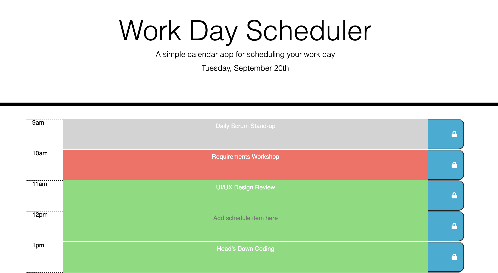

# JavaScript-Day-Scheduler
Jeremy Fulbright - Day Scheduler Project

## Project Resources:

- [ ] [GitHub Repo](https://github.com/jfulbright/JavaScript-Day-Scheduler)
- [ ] [GitHub Pages Demo](https://jfulbright.github.io/JavaScript-Day-Scheduler/)

***

## Description
The objective of this project was to create a javascript application for a simple calendar application that allows a user to save events for each hour of the day to localStorage. The timeblocks will have a visual styling depending if they're in the past, present and future. 

## Visuals
### Past Event UI Styling: 

### Present Event  UI Styling:

### Future Event UI Styling:

## Installation
This is a single page webpage using HTML, CSS and JavaScript. It can be installed on any web server.

## Usage
This site may not be used or copied.

## Roadmap
Future Roadmap Iterations will include:
* Code Simplification, UI/UX Enhancements, Improved Error Handling, and the ability to change days.

## License
See  [LICENSE](LICENSE "LICENSE") for more information.

## Project status
This deployed site is an MVP iteration where future functionality can be added. 
